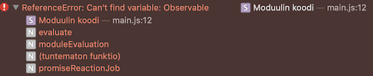

# BUGS

## Why does the screen clear?

---

Track -> https://github.com/rollup/rollup/issues/2820

---


```
$ npm run dev
```

Expected: screen would *not* clear before:

```

  Your application is ready~! 🚀
```

Actual: it does

The 

```
        watch: {
            clearScreen: false      // tbd. and yet the screen clears
        }
```

..in Rollback conf does not apply to this screen clear. What does? #help


Why: it would be nice to see the console output. It can now be peeked by PageUp, but still...


## No sourcemap?

Instead of this:



..we should see the `src/svg.rx.js` filename and line. Why not?

