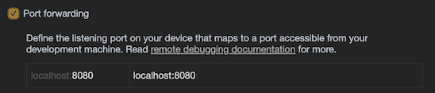
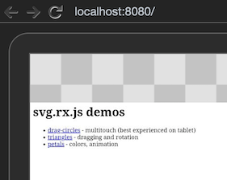

# Remote Debugging

Multitouch events cannot really be emulated on a regular (non-touch) desktop device, like a Mac. To develop for them, you need to attach an Android or iOS device with a USB cable to the development machine.

>This also expects that you are serving the demos locally, via `npm run serve`, e.g. in port 8080.

## Android Remote Debugging

Luckily, Chrome has an [Android Remote Debugging](https://developer.chrome.com/devtools/docs/remote-debugging) mode that works really well.

Follow the guidance to set it up. No installation of Android tools on the desktop are necessary. 

1. Enable USB debugging on the device
2. Open Chrome on the desktop, point to `chrome://inspect`
3. Check that the device is seen
4. Use the tool to see inside the Android Chrome instance

<!-- here used to be some screenshots, but they were old
-->

See [Access Local Servers](https://developers.google.com/web/tools/chrome-devtools/remote-debugging/local-server) for the next steps.

1. Go to `Settings` in the desktop Chrome and tick `Port forwarding` on:

   

2. Point the mobile Chrome to `localhost:8080`.

You should see:

Have fun - remember to use multiple fingers!

Refresh the mobile browser if you change the underlying code.

## iOS Remote Debugging

Safari has a a similar remote debugging setup, as Chrome:

1. Enable remote debugging on iOS: `Settings` > `Safari` > `Advanced` > `Web Inspector`

2. Open the demo hosted by your desktop (e.g. `http://192.168.1.234:8080`).

3. Open in desktop Safari `Developer` > `iPad (...)` > web page

   

Unlike Chrome, this does not seem to provide a mirror of the web rendering, but that's okay. You get access to the debugging tools.

In fact, not mirroring the rendered contents may be better, since it allows us to more realistically see the performance while connected with the device.

> 💡Hint: Tap `Connect via network` and you are not tied to the cable between the iOS device and the desktop. :)

