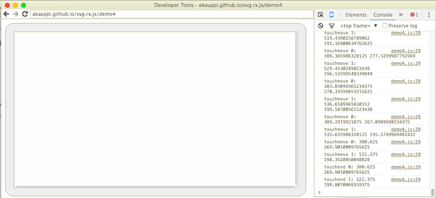

# Remote debugging

## Android Remote Debugging

Multitouch events cannot really be emulated on a regular (non-touch) desktop device, like a Mac. 

Luckily, Chrome has an [Android Remote Debugging](https://developer.chrome.com/devtools/docs/remote-debugging) mode that works really well.

Follow the rules to set it up. No installation of Android tools on the desktop are necessary.

1. Enable USB debugging on the device
2. Open Chrome, point to `chrome://inspect`
3. Check that the device is seen
4. Use the tool to see inside the Android Browser




You can also use "port forwarding" and "virtual host mapping" to run a web service locally, and use it from the tablet.

<!-- tbd. Add pics and details when have tried that -->

## iOS Remote Debugging

Safari on iOS has a a similar remote debugging setup, as the Android browser. Unfortunately, it does not seem to have the "port forwarding" feature but that's okay.

&nbsp;1. Enable remote debugging on iOS: `Settings` > `Safari` > `Advanced` > `Web Inspector`

&nbsp;2. Serve the web pages via

```
$ npm run serve
...
Available on:
  http:127.0.0.1:8080
  http:192.168.0.16:8080
Hit CTRL-C to stop the server
```

Use the latter IP from the phone to open the demo.

&nbsp;3. Open in desktop Safari `Developer` > `iPhone (...)` > web page


Reference:

- [Remote debugging iOS Safari on OS X, Windows and Linux](https://blog.idrsolutions.com/2015/02/remote-debugging-ios-safari-on-os-x-windows-and-linux/)

<br />
