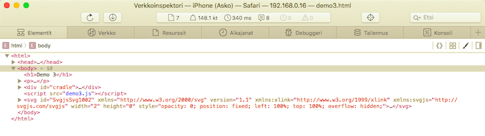

# Remote Debugging

Multitouch events cannot really be emulated on a regular (non-touch) desktop device, like a Mac. To debug them, you need to attach the device with a USB cable to the development machine.[^1]

[^1]: At least initially, in the case of iOS.

The guidance below expects you are hosting the demos on the development machine (`npm run dev`) at `192.168.1.234:5000`.

## Android Remote Debugging

Luckily, Chrome has an [Android Remote Debugging](https://developer.chrome.com/devtools/docs/remote-debugging) mode that works really well.

Follow the guidance to set it up. No installation of Android tools on the desktop are necessary. 

1. Enable USB debugging on the device
2. Open Chrome on the desktop, point to `chrome://inspect`
3. Check that the device is seen
4. Browser to `http://192.168.1.234:5000`

	>

5. Use the desktop tools to see inside of the mobile Chrome browser

Have fun!  Remember to try multiple fingers on the demos.

>👉 We are *not* using Chrome port forwarding because automatic change propagation does not work through it, for some reason.

## iOS Remote Debugging

Safari has a a similar remote debugging setup, as Chrome:

1. Enable remote debugging on iOS: `Settings` > `Safari` > `Advanced` > `Web Inspector`

2. Open the demo hosted by your desktop (e.g. `http://192.168.1.234:5000`).

3. Open in desktop Safari `Developer` > `iPad (...)` > web page

   

Unlike Chrome, this does not seem to provide a mirror of the web rendering, but that's okay. It may even be better, since this allows us to more realistically see the performance while connected to the device.

>💡Hint: `Connect via network` and you are not tied to the cable between the iOS device and the desktop. :)

