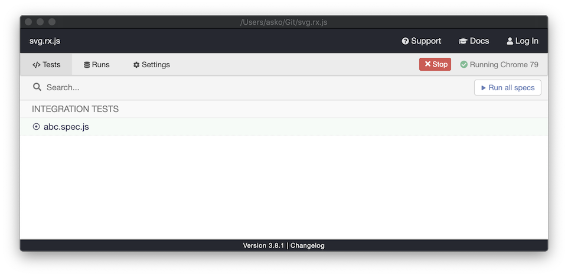
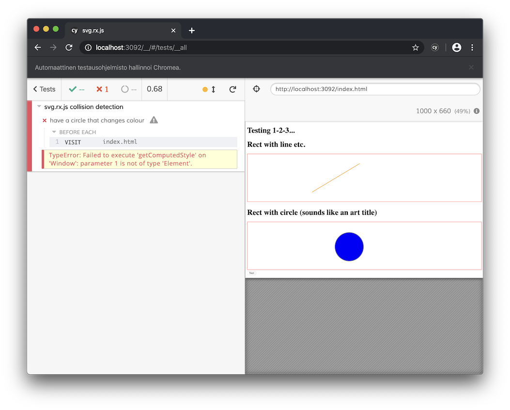

# svg.rx.js

[](https://gitter.im/akauppi/svg.rx.js?utm_source=badge&utm_medium=badge&utm_campaign=pr-badge&utm_content=badge)

## What is it?

`svg.rx.js` binds [RxJS](https://github.com/Reactive-Extensions/RxJS) together with SVG graphics. It's intended for Svelte 3 applications, but is published as a plain node.js browser-targeted library.

With `svg.rx.js`, you can:

- follow touch and mouse events on SVG graphic components, as an RxJS `Observable`, tremendously simplifying the code concerned.
- forget about most of conversions needed in the process

The end game is to get a simple programming paradigm for making SVG-only animated, interactive applications that run fast in the browser. This programming model was pioneered by (at least) [Asymetrix Toolbook](https://en.wikipedia.org/wiki/ToolBook) (1990-), [Macromedia/Adobe Flash](https://en.wikipedia.org/wiki/Adobe_Flash) (~1996-2020), and maybe originates in [HyperCard](https://fi.wikipedia.org/wiki/HyperCard) (1987-).

The reasons why this isn't already practical lie within the SVG details and simply missing workflows.


## Design goals

- touch and mouse should not seem very different
- touch first (treat mouse as a useable fallback 2nd class citizen)
- any touch is treated the same (enables multiuser touch on a big tablet/table)

Implementation details:

- every documented API must have unit tests
- value brewity of the code, and maintainability

<!-- disabled
- embrace Svelte 3, as a development abstraction and toolchain (doesn't necessarily matter to this project)
-->
  
## Platform scope

Scope of the project is SVG on modern "evergreen" browsers. That probably means no IE9..10 support (IE11 support can be added, if needed). In practice the code gets tested on:

- Latest Safari on macOS
- Latest Chrome on macOS
- Safari on iOS 13 (iPad Pro)
- Chrome on Android 9/10 (Sony Xperia phone) 

<!-- hidden (but take back?)
- Chrome on Andoid xxx (Nexus 7)
--> 

If you find platforms where it doesn't work for you, [issues](https://github.com/akauppi/svg.rx.js/issues) and pull requests are the way to go.

## Not supported
  
>Note: These details are from earlier version. To be updated, in 2020.
  
- Dragging of `SVG.Nested` and `SVG.Text`
  - there is special code for these in the [svg.draggable.js](https://github.com/wout/svg.draggable.js) project but since we don't have demos for these, we are currently not supporting them, at all

- Changing the draggable object's conversion matrix (scaling, rotation and translation) during a drag.
  - this is probably not needed in practical applications

Please send a PR if you need these - and provide a demo or test that proves when the support works.

---

## Requirements

- `npm`

<!-- disabled: are we going to use Cypress or Puppeteer?

If you run tests, Cypress gets installed, on-demand.
-->

## Getting started

Install the tools and dependencies (needed for running demos):

```
$ npm install
```

Run the tests:

```
$ npm test
```

## Running tests

The project has test cases that can be played with manually, or used for Cypress tests.

<!-- disabled: We may remove the mention of 'bare' if Cypress works nice. We can play with code manually in its Chrome session just as well. 
-->

### Test cases - bare

You can open a test page manually:

```
$ npm run test:dev
```

This builds a test page and serves it at `http://localhost:3000`. If you edit the `test` source, changes are immediately shown in the browser. Use this for developing the test cases.

#### Running on a mobile device

While `test:dev` is served, open the mobile device's browser at `http://192.168.1.234:3000` (IP mentioned by `npm run test:dev`).

This allows you to experiment with the demos. 

>For setting up remote debugging, see [DEV-TIPS/Remote debugging](DEV-TIPS/Remote%20debugging.md).


### Test cases - with Cypress UI

The test cases have unit tests written in Cypress (disclaimer: Cypress is *not* for unit tests - I know).

```
$ npm run cy:open
```

This opens the tests in Cypress, a test maniac.



You can select the browser from the top right, then run a certain test suite or "Run all specs".

The tests run in a separate browser window:



The nice thing about Cypress is you can time travel through the tests, seeing exactly what was going on in the browser. 


### Test cases in command line

The same tests can be run on the command line, by:

```
$ npm cy:run
...
       Spec                                              Tests  Passing  Failing  Pending  Skipped  
  ┌────────────────────────────────────────────────────────────────────────────────────────────────┐
  │ ✖  abc.spec.js                              00:01        1        -        1        -        - │
  └────────────────────────────────────────────────────────────────────────────────────────────────┘
    ✖  1 of 1 failed (100%)                     00:01        1        -        1        -        -  
```


<!-- disabled (no need?)
## Code

|||
|---|---|
|`src/main.js`|main entry point|
|`src/dragging.js`|dragging features|
-->

<!-- disabled (outdated)
## Usage 

>⚠️<font color=orange>WARNING: This section is out-of-date. To be corrected in 2020.</font>

<strike>You can simply download the `svg.rx.js` file and place it in your project.</strike>

>tbd. Make pulling dependencies a separate part. Here just API usage.


### HTML

...tbd.


### JavaScript API

The library extends `SVGElement` by:

```
.rx_draggable()		// () -> observable of observables of {x:int,y:int}
```

<!_-- disabled: treat them as an implementation detail?
If you only wish to handle mouse or touch, you can also use:

```
.rx_mouse()
.rx_touch()
```
--_>

### Sample

```
const outerObs = rect.rx_draggable();
    
outerObs.subscribe( function(dragObs) {
    console.log("Drag started");
    
    dragObs.subscribe( function(o) {       // {x:Int,y:Int}
        rect.move(o.x, o.y);
    },
    null, 	// no error handler
    function () {
        console.log("Drag ended");
	} );
} );
```

!!: The library does not move (drag) your object automatically. This is intentional and allows other kinds of dragging behaviour (e.g. constraints or circular following) to happen, instead of the usual 1:1 dragging.

</strike>
-->

## Publishing / using

You need a registered http://npmjs.com account, with access to publish this project.

See [publish/README.md](publish/README) for details.

Alpha and beta snapshots are published under the `next` tag. Stable versions follow the normal versioning.

<!-- disabled: say something about versions; can we sniff the latest stable?
```
    "svg.rx.js": "next"
    "svg.rx.js": "^0.0.7"
```
-->

## Help requested!!

See:
 
- `TODO.md`
- [GitHub Issues](https://github.com/akauppi/svg.rx.js/issues) 

for ways to help

---

## References

- [How to Use npm as a Build Tool](https://www.keithcirkel.co.uk/how-to-use-npm-as-a-build-tool/) - (blog, Dec 2014) by Keith Cirkel
- [End to End Testing a Web Application using Cypress](https://www.youtube.com/watch?v=woI490HRM34) (Youtube 20:40, Apr 2019)

<!-- disabled
- [Writing your first test](https://docs.cypress.io/guides/getting-started/writing-your-first-test.html#Add-a-test-file) (Cypress docs)
-->
